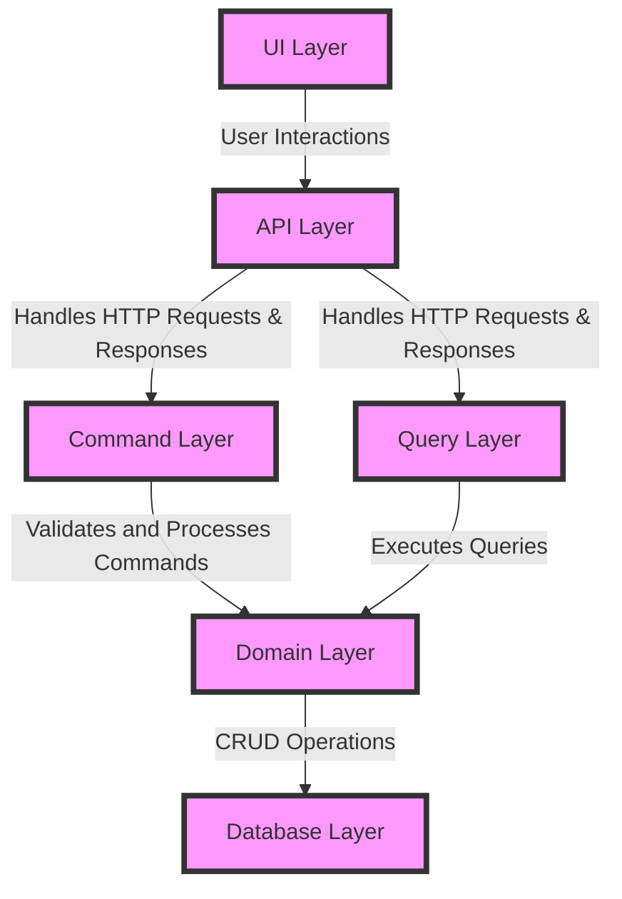

# ktor api scaffold

This repository provides a scaffold for building API projects using Kotlin and Ktor. It includes a preconfigured Docker
setup, making it easier to package and deploy your applications consistently across different environments. Whether you
are starting a new project or looking to streamline your development process, this scaffold offers a solid foundation
and best practices to accelerate your API development.

### CQRS Architecture

The Digital Account API is implemented using the Command Query Responsibility Segregation (CQRS) architecture. CQRS is a
pattern that separates the processing of commands (writes) from queries (reads), ensuring scalability, flexibility, and
maintainability in complex applications.

#### Advantages of CQRS

1. **Scalability:** By segregating the read and write operations, CQRS allows to scale each side independently as per
   the requirements.
2. **Optimal Performance:** Read and write operations can be optimized differently, thus improving the overall
   performance of the system.
3. **Simplified Code Base:** It simplifies the domain logic by separating command processing from query handling, making
   the code easier to understand and maintain.
4. **Flexibility:** Allows the use of different models for reading and writing, which can be optimized for their
   respective concerns.
5. **Event Sourcing:** Paves the way for implementing event sourcing, which records all changes to an application state
   as a sequence of events, ensuring strong audit capabilities.

#### CQRS Architecture Layers



- **UI Layer:** This layer captures user interactions and sends requests to the API Layer.
- **API Layer:** This layer receives HTTP requests, validates them, and routes them to the appropriate Command or Query
  Layer.
- **Command Layer:** This layer handles command processing (CREATE, UPDATE, DELETE) by applying business logic and
  interacts with the underlying Domain Layer.
- **Query Layer:** This layer handles query processing (READ) by retrieving data via the Domain Layer.
- **Domain Layer:** This layer contains the business logic, ensuring that data interactions follow the business rules.
- **Database Layer:** This layer handles the CRUD operations with the database, maintaining the persistent storage of
  account data.

#### Argument for Choosing CQRS

The CQRS architecture was chosen for the Scaffold API because it effectively handles the complexity and
scalability requirements of large set of applications. By separating read and write functionalities, it
provides a clear path for optimizing various aspects of the system independently. Additionally, it simplifies the
maintenance of the codebase and supports future growth, allowing for enhanced performance and flexibility.

#### References

- [Martin Fowler on CQRS](https://martinfowler.com/bliki/CQRS.html)
- [Microsoft Documentation on CQRS Pattern](https://docs.microsoft.com/en-us/azure/architecture/patterns/cqrs)
- [CQRS by Greg Young](https://cqrs.files.wordpress.com/2010/11/cqrs_documents.pdf)

### Use of Ktor and Kotlin

The Scaffold API utilizes Ktor as its framework and Kotlin as its programming language. Ktor is a modern and
lightweight web framework built specifically for Kotlin, which facilitates the creation of asynchronous servers and web
applications. Leveraging Kotlin’s expressive syntax and robust features, Ktor allows for intuitive code writing, making
it perfect for crafting scalable and maintainable microservices. The combination of Ktor and Kotlin provides a powerful
stack for developing server-side applications with high performance, concise code, and seamless integration with
existing tools and libraries.

#### Justification for Ktor and Kotlin

Choosing Ktor and Kotlin for the Scaffold Account API stack offers several advantages. Kotlin, known for its expressive
syntax and interoperability with Java, ensures that developers can write concise and readable code while leveraging
existing Java libraries. Its statically-typed nature adds an extra layer of safety, reducing runtime errors through
compile-time checks. Ktor, designed to work seamlessly with Kotlin, streamlines the process of building asynchronous web
applications, providing high performance while requiring minimal boilerplate code. This stack is particularly suitable
for microservices due to its support for coroutine-based concurrency, making it highly efficient for handling concurrent
connections.

### Links and References

- [Kotlin Documentation](https://kotlinlang.org/docs/home.html)
- [Ktor Documentation](https://ktor.io/docs/)
- [Ktor GitHub Repository](https://github.com/ktorio/ktor)

### Running the API Locally

To run the API locally, follow the instructions below. Make sure you have Docker installed as it is a
dependency for running the service.

#### Prerequisites

1. **Docker:** The API uses Docker to manage its runtime environment. If you do not have Docker installed on your
   machine, you can follow the instructions from the [Docker Installation Guide](https://docs.docker.com/get-docker/).

#### Steps to Run the API

1. **Clone the Repository:** Clone the repository containing the Scaffold API to your local machine.
    ```sh
    git clone https://github.com/FernandoAvanzo/ktor-api-scaffold.git
    cd ktor-api-scaffold
    ```

2. **Run the API Script:** Execute the provided script to start the API.
    ```sh
    ./runLocalAPI.sh
    ```

   This script will perform the following tasks:
    - Build the Docker image for the API.
    - Create and run a Docker container based on the created image.

### To Do

- [ ] Write README for the forked project